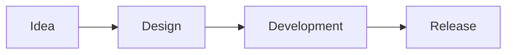

This post is a short summary of the Chirpy documentation sections I use most often.

## Headings and Text

### Subheading Example

Regular paragraph text goes here. You can use **bold**, *italic*, and `inline code` where needed.

## Prompt Boxes

> This is a tip prompt.
{: .prompt-tip }

> This is an info prompt.
{: .prompt-info }

> This is a warning prompt.
{: .prompt-warning }

## Code Block

```yaml
categories: [Portfolio, Projects]
tags: [api, backend]
```
{: file="post-front-matter.yml" }

## Image Usage

{: w="640" h="640" }
_A simple image caption example._

## Social Media Video Embed



## Mermaid Example



These examples provide a quick starting point when writing new posts.
